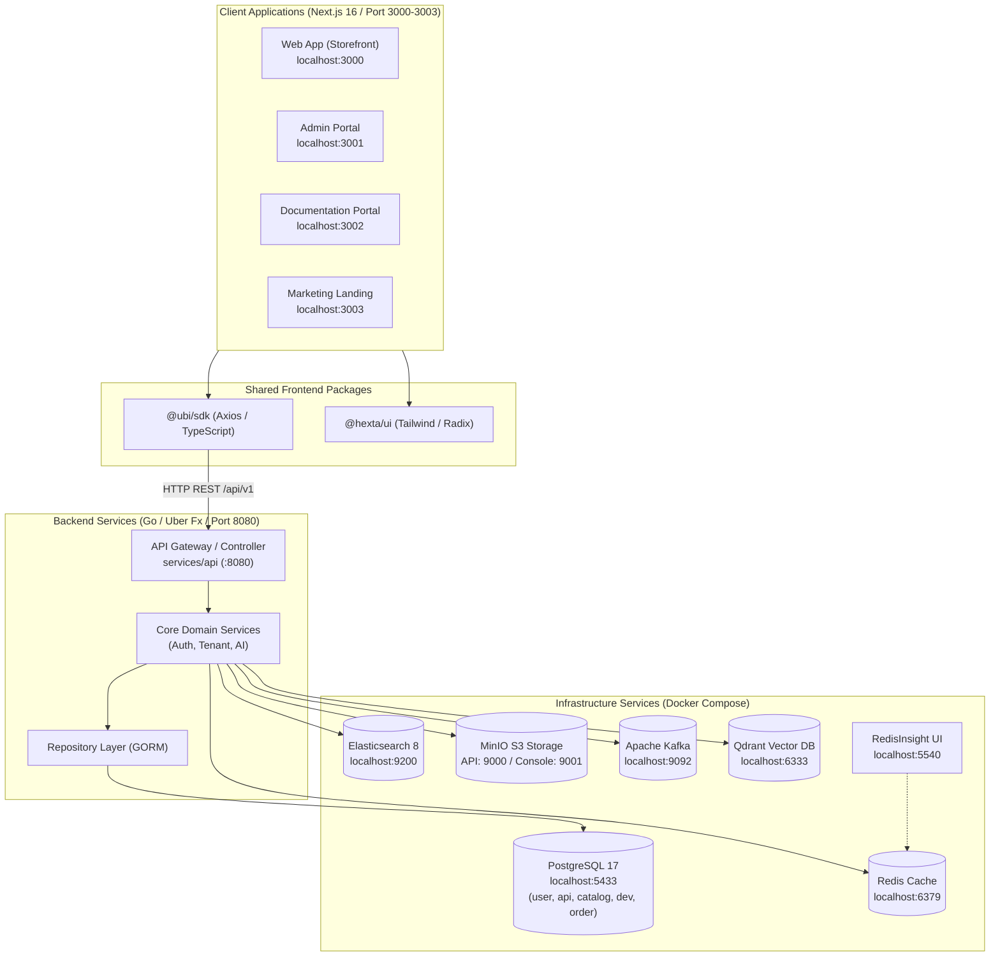
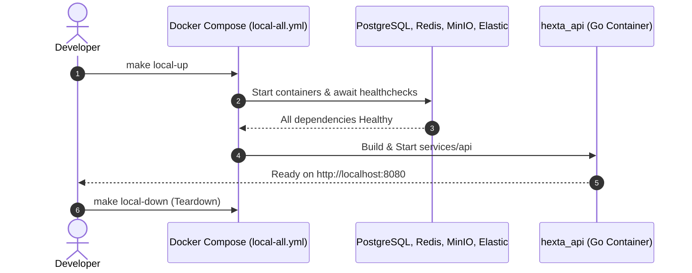
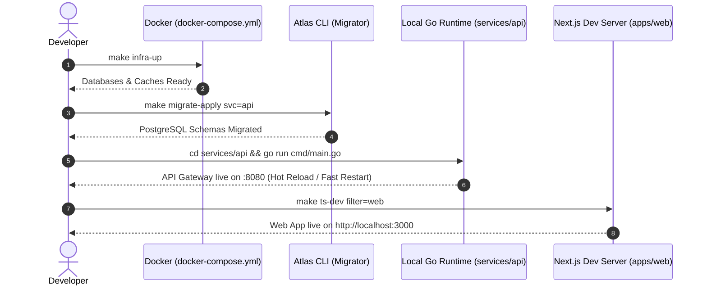

# Technical Design: System Architecture & Local Development Orchestration

- **Issue**: [#18](https://github.com/TruongHoang2004/Hexta/issues/18)
- **Title**: docs: create comprehensive local development guide ("How to run system in local machine")
- **Date**: 2026-09-12
- **Document Status**: Approved / In-Implementation
- **Target File**: `agentic-memory/designs/2026-09-12_issue-18-local-dev-guide_design.md`

---

## 1. Design Summary
The Hexta platform is a modern e-commerce and multi-tenant management ecosystem structured as a polyglot monorepo. It integrates:
- **Backend**: Go (v1.24+) utilizing Gin, Uber Fx dependency injection, GORM, Atlas database migrations, and Zap structured logging.
- **Frontend Applications**: Next.js 16 (React 19, Tailwind CSS) structured in `apps/` (`web`, `admin`, `docs`, `landing`).
- **Shared Libraries & Packages**: TypeScript SDK (`@ubi/sdk`), shared UI components (`@hexta/ui`), and Go shared packages (`gitlab.com/ecommercehub1/shared`).
- **Infrastructure Services**: PostgreSQL 17, Redis, Elasticsearch 8, MinIO S3, Apache Kafka, Qdrant Vector DB, and RedisInsight.

Prior to this design, onboarding instructions were scattered across disparate readmes and Makefiles with conflicting network settings and missing environment templates. This design formalizes the local development topology, execution modes, port allocation, and reproducibility guidelines.

---

## 2. System Architecture & Data Flow

### 2.1 Monorepo Topology

### 2.2 Synchronous vs Asynchronous Communication Flows
1. **Synchronous Flow (Client -> API -> Database/Cache)**:
   - Next.js Web App sends client HTTP requests to `http://localhost:8080/api/v1/*` via `@ubi/sdk`.
   - The Go API controller validates request DTOs with `go-playground/validator`.
   - The Service layer executes business logic, querying PostgreSQL through GORM and caching session/token states in Redis.
   - Synchronous health verification is exposed via `/api/v1/health` and Swagger UI at `/api/v1/swagger/index.html`.
2. **Asynchronous Flow (Events & AI Processing)**:
   - Event emission via Kafka broker (`localhost:9092`) for domain events.
   - Vector indexing and semantic retrieval powered by Qdrant (`localhost:6333`).
   - Unstructured media/asset uploads streamed directly to MinIO S3 (`localhost:9000`).

---

## 3. Service Architecture & Port Reference Matrix

| Service / Component | Container / Process | Host Port | Container Port | Protocol / Path | Default Credentials / Purpose |
|---|---|---|---|---|---|
| **PostgreSQL 17** | `hexta_postgres` | `5433` | `5432` | TCP / Postgres | `postgres / postgres` DBs: `api`, `user`, `catalog`, `dev`, `order` |
| **Redis** | `hexta_redis` | `6379` | `6379` | TCP / RESP | No password default; in-memory caching & rate limiting |
| **Elasticsearch 8** | `hexta_elasticsearch` | `9200`, `9300` | `9200`, `9300` | HTTP / TCP | `http://localhost:9200` (xpack security disabled for local dev) |
| **MinIO Object Storage** | `hexta_minio` | `9000` | `9000` | HTTP / S3 API | User: `minioadmin` Pass: `minioadmin` |
| **MinIO Console (UI)** | `hexta_minio` | `9001` | `9001` | HTTP / Web UI | `http://localhost:9001` Web dashboard for buckets |
| **Apache Kafka** | `hexta_kafka` | `9092` | `9092` | TCP / PLAINTEXT | Distributed event streaming broker |
| **Qdrant Vector DB** | `hexta_qdrant` | `6333`, `6334` | `6333`, `6334` | HTTP / gRPC | `http://localhost:6333/dashboard` Vector search engine |
| **RedisInsight** | `ecommerce_redisinsight` | `5540` | `5540` | HTTP / Web UI | `http://localhost:5540` Redis visual browser |
| **API Service (Go)** | Host binary / `hexta_api` | `8080` | `8080` | HTTP / REST | Core backend & Swagger UI (`/api/v1/swagger/index.html`) |
| **Web App (Next.js)** | `apps/web` | `3000` | `3000` | HTTP / HTML | Customer storefront web application |
| **Admin App (Next.js)** | `apps/admin` | `3001` | `3001` | HTTP / HTML | Administrative management console |
| **Docs App (Next.js)** | `apps/docs` | `3002` | `3002` | HTTP / HTML | Technical documentation portal |
| **Landing App (Next.js)**| `apps/landing` | `3003` | `3003` | HTTP / HTML | Marketing & promotional landing site |

---

## 4. Execution Modalities

### Mode A: Full Docker Quickstart

### Mode B: Hybrid Developer Workflow (Recommended for Day-to-Day Engineering)

---

## 5. Environment & Secrets Hierarchy

The system follows a strict hierarchical configuration model:
1. **Base YAML Defaults (`services/api/config/config.yaml`)**:
   - Out-of-the-box local endpoints: PostgreSQL at `localhost:5433/api`, Redis at `localhost:6379`.
2. **Environment File Overrides (`.env`)**:
   - `services/api/.env` expands `${JWT_ACCESS_TOKEN_SECRET}`, `${GOOGLE_CLIENT_ID}`, etc.
   - `apps/web/.env` defines `NEXT_PUBLIC_API_URL=http://localhost:8080`.
   - `infrastructure/.env` controls container credentials (`POSTGRES_PASSWORD`, `MINIO_ROOT_PASSWORD`).
3. **OS Environment Variables (`export VAR=...`)**:
   - Precedence highest, overriding `.env` and `config.yaml` values dynamically.

---

## 6. Failure Recovery & Troubleshooting Workflows

1. **Host PostgreSQL Port Collision (5432 Conflict)**:
   - **Problem**: Host machine runs a native PostgreSQL instance on `5432`.
   - **Resolution**: Hexta maps container port `5432` to host port `5433`. All local applications connect to `localhost:5433` (as preconfigured in `config.yaml`).
2. **Atlas Migration Drift / Checksum Mismatch**:
   - **Problem**: Direct SQL alterations cause Atlas `atlas.sum` hash mismatch.
   - **Resolution**: Run `make migrate-hash svc=api` to update the checksum file.
3. **Clean Slate Database & Cache Reset**:
   - **Problem**: Stale volume state or broken test data.
   - **Resolution**: Execute `make clean`, which stops containers and removes `./infrastructure/volumes` bind mounts.
4. **Google OAuth Local Redirection**:
   - **Configuration**: Google Cloud Console authorized redirect URI must be set to `http://localhost:8080/api/v1/auth/google/callback`.
