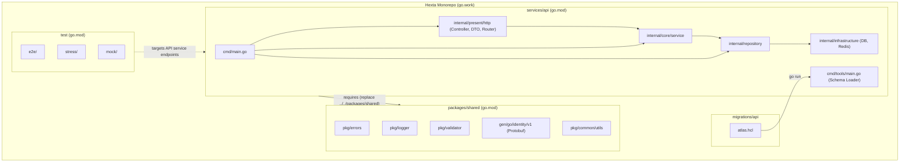

# Technical Design: Go Module Path & Package Namespace Migration

- **Issue**: [#20](https://github.com/TruongHoang2004/Hexta/issues/20)
- **Date**: 2026-09-12
- **Branch**: `task/issue-20-refactor-go-migrate-go-module-paths-and-`
- **Scope**: Module Declarations, Dependency Graph, Protobuf Schema, Atlas Migration Loader, OpenAPI Specs

---

## 1. Design Summary
The Hexta repository was originally established under the GitLab group `gitlab.com/ecommercehub1`. Following its relocation to GitHub at `github.com/TruongHoang2004/Hexta`, legacy module declarations (`gitlab.com/ecommercehub1/*`) remained in place.

This technical design defines the new module namespace hierarchy, the package mapping matrix, the protobuf generation parameters, the migration loader execution contracts, and verification procedures across all services.

### Key Architectural Decisions
1. **Canonical Module Namespaces**:
   - `github.com/TruongHoang2004/Hexta/packages/shared`: Shared libraries (`errors`, `logger`, `validator`, `telemetry`, protobuf bindings).
   - `github.com/TruongHoang2004/Hexta/services/api`: Main backend REST API service.
   - `github.com/TruongHoang2004/Hexta/test`: E2E, mock, and stress testing suite.
2. **Workspace & Local Replace Compatibility**:
   - For monorepo local development, `go.work` continues to provide seamless cross-module compilation without fetching from remote Git.
   - In `services/api/go.mod`, a local `replace` directive `replace github.com/TruongHoang2004/Hexta/packages/shared => ../../packages/shared` ensures isolated builds (e.g. inside Docker or CLI builds) continue functioning before remote GitHub tags are published.
3. **Protobuf Compilation Standards**:
   - Proto definitions in `packages/shared/proto/` compile to Go packages using `go_opt=module=github.com/TruongHoang2004/Hexta/packages/shared`.
4. **Atlas GORM Schema Provider**:
   - `migrations/api/atlas.hcl` specifies the schema provider entrypoint via `"go", "run", "github.com/TruongHoang2004/Hexta/services/api/cmd/tools"`.

---

## 2. System Architecture & Module Dependency Flow



---

## 3. Package Mapping Matrix

| Legacy Path (`gitlab.com/ecommercehub1/...`) | Canonical Path (`github.com/TruongHoang2004/Hexta/...`) | Purpose |
| :--- | :--- | :--- |
| `gitlab.com/ecommercehub1/shared` | `github.com/TruongHoang2004/Hexta/packages/shared` | Shared module root |
| `gitlab.com/ecommercehub1/shared/gen/go/identity/v1` | `github.com/TruongHoang2004/Hexta/packages/shared/gen/go/identity/v1` | Identity protobuf Go package |
| `gitlab.com/ecommercehub1/shared/pkg/errors` | `github.com/TruongHoang2004/Hexta/packages/shared/pkg/errors` | Standard error handling |
| `gitlab.com/ecommercehub1/shared/pkg/logger` | `github.com/TruongHoang2004/Hexta/packages/shared/pkg/logger` | Structured logger wrapper |
| `gitlab.com/ecommercehub1/shared/pkg/validator` | `github.com/TruongHoang2004/Hexta/packages/shared/pkg/validator` | Custom struct validation |
| `gitlab.com/ecommercehub1/shared/pkg/telemetry` | `github.com/TruongHoang2004/Hexta/packages/shared/pkg/telemetry` | OpenTelemetry integration |
| `gitlab.com/ecommercehub1/api` | `github.com/TruongHoang2004/Hexta/services/api` | API service module root |
| `gitlab.com/ecommercehub1/api/cmd` | `github.com/TruongHoang2004/Hexta/services/api/cmd` | Entrypoint |
| `gitlab.com/ecommercehub1/api/cmd/tools` | `github.com/TruongHoang2004/Hexta/services/api/cmd/tools` | Atlas GORM schema extractor |
| `gitlab.com/ecommercehub1/api/common/...` | `github.com/TruongHoang2004/Hexta/services/api/common/...` | API service common helpers |
| `gitlab.com/ecommercehub1/api/internal/...` | `github.com/TruongHoang2004/Hexta/services/api/internal/...` | 5-layer architecture modules |
| `gitlab.com/ecommercehub1/test` | `github.com/TruongHoang2004/Hexta/test` | Test module root |

---

## 4. Protobuf & Migration Loader Contracts

### 4.1. Protobuf Declaration
In `packages/shared/proto/identity.proto`:
```protobuf
syntax = "proto3";

package identity.v1;

option go_package = "github.com/TruongHoang2004/Hexta/packages/shared/gen/go/identity/v1;identityv1";
```

Generation command:
```bash
protoc -Ipackages/shared/proto \
  --go_out=packages/shared \
  --go_opt=module=github.com/TruongHoang2004/Hexta/packages/shared \
  --go-grpc_out=packages/shared \
  --go-grpc_opt=module=github.com/TruongHoang2004/Hexta/packages/shared \
  packages/shared/proto/identity.proto
```

### 4.2. Atlas Migration Loader (`migrations/api/atlas.hcl`)
```hcl
data "external_schema" "gorm" {
  program = [
    "go",
    "run",
    "github.com/TruongHoang2004/Hexta/services/api/cmd/tools"
  ]
}
```

---

## 5. Security, Caching & Performance Considerations
- **Build Reproducibility**: Replacing non-existent GitLab URLs with valid GitHub module namespaces prevents build disruptions when external tools run `go list -m all`.
- **Module Caching**: Go caches modules by path and hash. Cleaning obsolete GitLab references prevents downloading spurious or broken remote packages.
- **Zero Runtime Overhead**: Package renaming occurs purely at compile-time and has zero runtime CPU or memory penalty.
