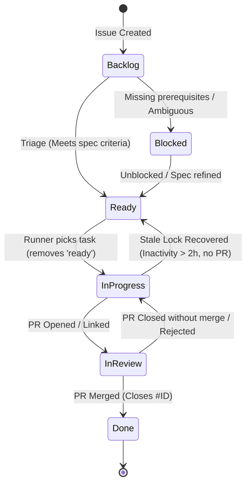
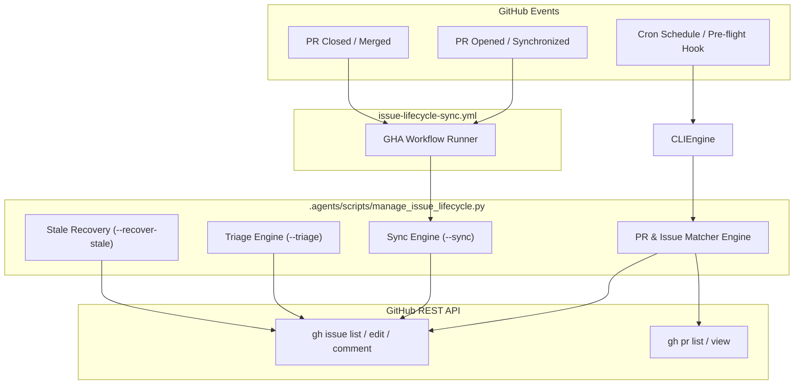

# Technical Design: Issue Lifecycle Manager & Parallel State Synchronization Workflow

- **Feature**: Issue Lifecycle Manager & State Synchronization
- **Issue**: [#22](https://github.com/TruongHoang2004/Hexta/issues/22)
- **Date**: 2026-09-12
- **Author**: Autonomous Task Runner Agent
- **Status**: Draft / Approved

---

## 1. Design Summary

The autonomous task automation system in Hexta coordinates multiple processes:
- Background task runners picking up work from GitHub issues.
- Autonomous coding agents creating feature branches and opening pull requests.
- Human reviewers merging or closing pull requests.

Without an automated state reconciliation mechanism, labels fall out of sync:
1. When PRs are merged or issues are closed, stale development labels (`in-progress`, `in-review`) linger on closed issues indefinitely.
2. If an agent crashes or abandons a task, the issue remains locked under `in-progress`, blocking other runners from picking it up.
3. Backlog issues lack automatic triage to verify quality and promote them to `ready`.

This design establishes a dual-layer synchronization architecture:
- **Event-Driven GitHub Action (`.github/workflows/issue-lifecycle-sync.yml`)**: Fires instantly on pull request events (`opened`, `reopened`, `closed`, `synchronize`), maintaining real-time label parity.
- **Reconciliation & Triage Engine (`.agents/scripts/manage_issue_lifecycle.py`)**: A Python CLI tool providing scheduled, pre-flight, and on-demand synchronization (`--sync`), backlog quality triage (`--triage`), and zombie lock recovery (`--recover-stale`).

---

## 2. System Architecture & Lifecycle State Machine

### 2.1 State Machine
The lifecycle transitions between 5 canonical states:



### 2.2 System Component Flow



---

## 3. Core Modules & Algorithms

### 3.1 PR-to-Issue Association Resolution
PRs can link to issues via multiple channels:
1. **Branch Naming**: Branch pattern `task/issue-(\d+)(?:-.*)?` (primary standard in Hexta).
2. **Closing Keywords in PR Body**: `(?:closes|close|closed|fixes|fix|fixed|resolves|resolve|resolved)\s+#(\d+)`.
3. **Reference Keywords in PR Body or Title**: `(?:refs|ref|references|see)\s+#(\d+)` or general `#(\d+)`.

The algorithm extracts all matching issue numbers and associates each with the PR's status (`OPEN`, `CLOSED`, `MERGED`).

### 3.2 Reconciliation Engine (`--sync`)
For each issue in the repository:
1. **If Issue is `CLOSED`**:
   - Check if any development lifecycle labels remain: `in-progress`, `in-review`, `ready`.
   - Remove these labels to clean up completed/terminated tasks.
2. **If Issue is `OPEN`**:
   - Check if there is an associated **OPEN PR**:
     - Ensure the issue has label `in-review`.
     - Remove `in-progress` and `ready` labels if present.
   - Check if all associated PRs are **MERGED**:
     - Issue should have been closed automatically; if still open, remove `in-progress` and `in-review`.
   - Check if associated PR was **CLOSED without merge**:
     - If no other open PR exists and issue has `in-review`, revert to `in-progress` or `ready`.

### 3.3 Backlog Triage Engine (`--triage`)
Scans open issues that lack status labels (`ready`, `in-progress`, `in-review`, `blocked`):
1. **Quality Criteria**:
   - Title has minimum length (>= 10 chars).
   - Body contains actionable descriptions (>= 50 chars).
   - Body contains structured sections or task checklist (`[ ]` or `[x]`).
2. **Promotion**:
   - If quality criteria pass:
     - Assign `ready` label.
     - If no priority label (`priority:high`, `priority:medium`, `priority:low`) exists, infer from title (e.g. `security` / `fix` -> `priority:high`, `feat` -> `priority:medium`, else `priority:medium`).
   - If quality criteria fail:
     - Post a prompt asking for specification details (or flag as needing triage).

### 3.4 Stale Lock Recovery Engine (`--recover-stale`)
Prevents deadlocks when tasks are claimed but abandoned:
1. Query open issues with label `in-progress`.
2. For each issue:
   - Check if an open PR exists linked to this issue. If yes, skip recovery (it will be transitioned to `in-review` by `--sync`).
   - Parse `updatedAt` timestamp of the issue.
   - Calculate elapsed inactivity: `elapsed_hours = (current_time - updated_at)`.
   - If `elapsed_hours >= stale_hours` (default: 2.0 hours):
     - Strip `in-progress` label.
     - Add `ready` label.
     - Append an audit comment: `"Task recovered from stale in-progress state (no activity for X hours). Restored to 'ready' queue."`

---

## 4. CLI Argument Interface Specification

```bash
usage: manage_issue_lifecycle.py [-h] [--sync] [--triage] [--recover-stale]
                                 [--stale-hours STALE_HOURS] [--dry-run]
                                 [--verbose] [--json]

Automated Issue Lifecycle Manager and State Synchronizer for Hexta

options:
  -h, --help            show this help message and exit
  --sync                Reconcile PR and issue states and clean up closed issues
  --triage              Audit open backlog issues and promote qualified issues to 'ready'
  --recover-stale       Unlock stale 'in-progress' issues inactive for > threshold
  --stale-hours HOURS   Inactivity threshold in hours for stale recovery (default: 2.0)
  --dry-run             Simulate label changes and comments without mutating GitHub state
  --verbose             Enable verbose logging output
  --json                Emit output in structured JSON format
```

### JSON Output Schema
```json
{
  "timestamp": "2026-09-12T10:20:00Z",
  "mode": ["sync", "recover-stale"],
  "dry_run": false,
  "stats": {
    "issues_scanned": 22,
    "prs_scanned": 11,
    "labels_removed": 3,
    "labels_added": 1,
    "stale_recovered": 0,
    "triaged_ready": 0
  },
  "actions": [
    {
      "issue_number": 1,
      "title": "feat(config): add AI service provider configuration support",
      "action": "remove_labels",
      "labels": ["in-progress"],
      "reason": "Issue is CLOSED; stripped stale in-progress label"
    }
  ]
}
```

---

## 5. GitHub Actions Workflow Design

File: `.github/workflows/issue-lifecycle-sync.yml`

```yaml
name: Issue Lifecycle State Synchronization

on:
  pull_request:
    types: [opened, reopened, closed, synchronize]
  schedule:
    # Background sync and stale recovery every 30 minutes
    - cron: '*/30 * * * *'
  workflow_dispatch:
    inputs:
      dry_run:
        description: 'Run in dry-run mode (no label mutations)'
        required: false
        type: boolean
        default: false
      recover_stale:
        description: 'Include stale in-progress lock recovery'
        required: false
        type: boolean
        default: true

permissions:
  issues: write
  pull-requests: write
  contents: read

jobs:
  sync:
    name: Reconcile Issue States
    runs-on: ubuntu-latest
    steps:
      - name: Checkout Repository
        uses: actions/checkout@v4

      - name: Set up Python
        uses: actions/setup-python@v5
        with:
          python-version: '3.12'

      - name: Execute Lifecycle Synchronization
        env:
          GH_TOKEN: ${{ secrets.GITHUB_TOKEN }}
        run: |
          FLAGS="--sync"
          if [ "${{ github.event_name }}" = "schedule" ] || [ "${{ github.event.inputs.recover_stale }}" = "true" ]; then
            FLAGS="$FLAGS --recover-stale"
          fi
          if [ "${{ github.event.inputs.dry_run }}" = "true" ]; then
            FLAGS="$FLAGS --dry-run"
          fi
          python3 .agents/scripts/manage_issue_lifecycle.py $FLAGS --verbose
```

---

## 6. Task Runner Skill Integration (`github-task-runner`)

In `.agents/skills/github-task-runner/SKILL.md`:
Before calling `./.agents/scripts/get_next_issue.sh`, insert a Pre-flight State Synchronization step:
```bash
python3 .agents/scripts/manage_issue_lifecycle.py --sync --recover-stale
```
This guarantees:
1. If a previous agent run crashed or timed out, the abandoned issue is cleanly restored to `ready` before the priority queue is evaluated.
2. If any PR was opened or merged out-of-band, the repository state is 100% consistent before selecting the next task.

---

## 7. Security, Performance & Error Handling

1. **Idempotence**: Every label removal and addition operation checks existing labels before invoking `gh issue edit`. If an issue already has `in-review` and does not have `in-progress`, zero API calls are made.
2. **Rate Limit Conservation**: The script batches queries using `gh issue list` and `gh pr list` with JSON filters rather than performing individual queries per issue.
3. **Dry-Run Guarantee**: The `--dry-run` flag prints planned mutations without modifying GitHub repository state, enabling test verification in CI or local workstations.
4. **Resilience to Network / CLI Failures**: `gh` execution errors are captured and reported without crashing the entire pipeline.
