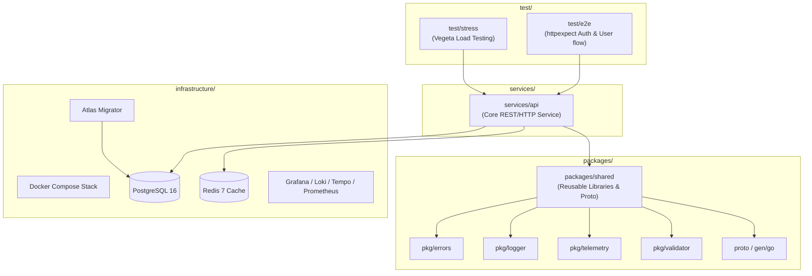

# Technical Design: Documentation Standardization & Legacy Reference Elimination

**Date**: 2026-09-13  
**Target Issue**: #21 - docs: replace legacy gitlab references and template readmes with project standards  
**Feature Branch**: `task/issue-21-docs-replace-legacy-gitlab-references-an`  

---

## 1. Design Summary
Following the repository migration to GitHub under `github.com/TruongHoang2004/Hexta`, legacy references to GitLab remained in core project governance documents (`GEMINI.md`, `agentic-memory/rules/development-rules.md`, `.agents/skills/dev-design/SKILL.md`) and boilerplate default GitLab templates resided in `packages/shared`, `infrastructure`, and `test`.

This technical design establishes:
1. **Repository-Wide Documentation Taxonomy**: Clear standards for documentation across monorepo services, shared libraries, infrastructure, and test suites.
2. **AI & Architectural Governance Alignment**: Accurate module paths (`github.com/TruongHoang2004/Hexta/packages/shared/pkg/errors`), correct 5-layer Go architecture boundaries, and proper monorepo layout references (`services/` and `packages/`).
3. **Comprehensive Component Documentation**:
   - `packages/shared`: Detailed architecture and API usage for `logger`, `errors`, `telemetry`, `validator`, and `proto`.
   - `infrastructure`: Docker Compose environments, database containers (Postgres, Redis), migration orchestration with Atlas, and observability tools.
   - `test`: Integration test harness (`httpexpect/v2`), end-to-end API flows, and performance stress testing (`vegeta`).
   - `services/api`: Updated GitHub clone URLs and operational instructions.

---

## 2. System Architecture & Component Breakdown

---

## 3. Documentation Taxonomy & Component Specifications

### 3.1 `packages/shared/README.md`
- **Identity**: Shared utilities and domain primitives for the Hexta platform.
- **Components**:
  - `pkg/errors`: Custom structured error types (`*errors.Error`), standard HTTP code mapping, error wrapping, stack traces.
  - `pkg/logger`: Uber Zap wrapper supporting production JSON and development console modes, contextual fields.
  - `pkg/telemetry`: OpenTelemetry (OTel) instrumentation for tracing, gRPC and HTTP middlewares, Prometheus metric exporting.
  - `pkg/validator`: Custom Gin/Go-Playground validator extensions (e.g. phone numbers, password strength).
  - `proto`: Protocol Buffers definitions and generated Go stubs (`gen/go/identity/v1`).
- **Standardized Navigation**: Deep links to source directories, installation instructions, and concrete Go code snippets demonstrating usage.

### 3.2 `infrastructure/README.md`
- **Identity**: Local and containerized infrastructure orchestration for Hexta.
- **Components**:
  - **Docker Compose Profiles**:
    - `docker-compose.yml`: Core stateful services (PostgreSQL 16, Redis 7).
    - `docker-compose.migrate.yml`: Atlas migration runner container.
    - `docker-compose.log.yml`: Observability stack (Prometheus, Grafana, Loki, Promtail, Tempo).
    - `docker-compose.ui.yml`: Adminer / Redis Commander web interfaces.
    - `local-all.yml`: Composite stack combining all services and infrastructure.
  - **Database Migrations**: Atlas declarative and versioned migration workflow, schema init scripts (`init-scripts/`).
  - **Common Commands**: Clear Makefile execution reference (`make up`, `make down`, `make clean`, `make migrate-apply`).

### 3.3 `test/README.md`
- **Identity**: Integration and performance test harnesses for Hexta services.
- **Components**:
  - **E2E Testing (`test/e2e`)**: End-to-end integration test suite using `github.com/gavv/httpexpect/v2`. Verifies authentication lifecycle (register -> login -> token validation -> refresh token rotation -> user profile retrieval).
  - **Stress Testing (`test/stress`)**: High-throughput load testing engine using `github.com/tsenart/vegeta/v12`. Simulates sustained user registration and authentication traffic.
  - **Execution**: Clear CLI instructions for running tests via `make test`, `make test-v`, `make stress`, and test cache management.

### 3.4 `services/api/README.md`
- **Update**:
  - GitHub clone URL: `git clone https://github.com/TruongHoang2004/Hexta.git`
  - Working directory navigation: `cd Hexta/services/api`
  - Title and naming alignment with Hexta API service.

---

## 4. Governance & Rules Synchronization

### 4.1 `GEMINI.md`
- Rename "CommerceHub" -> "Hexta".
- Fix monorepo layout references: `services/` (not `backend/service/`) and `packages/` (not `backend/lib/`).
- Update error handling rule: `github.com/TruongHoang2004/Hexta/packages/shared/pkg/errors`.

### 4.2 `agentic-memory/rules/development-rules.md`
- Clean title and context: "Hexta codebase" (remove "CommerceHub").
- Update error handling import rule to `github.com/TruongHoang2004/Hexta/packages/shared/pkg/errors`.

### 4.3 `.agents/skills/dev-design/SKILL.md`
- Update error package reference to `github.com/TruongHoang2004/Hexta/packages/shared/pkg/errors`.

### 4.4 Root `Makefile`
- Update header to `# Main Makefile for Hexta Platform`.

---

## 5. Security & Verification Strategy
- **Grep Audit**: Execute `git grep -i "gitlab.com"` across all project READMEs, rules, and AI guidance documents to guarantee 0 matches.
- **Markdown Linting**: Verify all headings, code blocks, lists, and tables adhere to CommonMark standards.
- **Link Integrity**: Validate that all repository URLs point to `https://github.com/TruongHoang2004/Hexta`.
