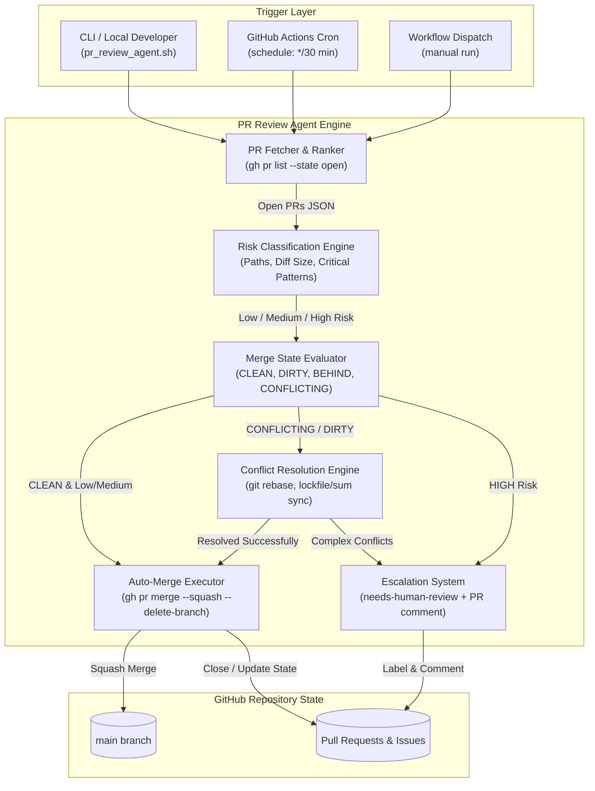

# Technical Design: Autonomous PR Review Agent & Conflict Escalation Engine

**Date**: 2026-09-13  
**Issue**: [#26 - feat(automation): implement PR review agent with auto-merge for simple PRs and conflict escalation](https://github.com/TruongHoang2004/Hexta/issues/26)  
**Branch**: `task/issue-26-feat-automation-implement-pr-review-agen`  

---

## 1. Design Summary

The Autonomous PR Review Agent is designed to bridge the gap between automated task completion (`github-task-runner` producing PRs in `in-review`) and final integration into `main`. The system continuously evaluates open Pull Requests, classifies their blast radius and risk profile, performs squash merges for clean low-risk contributions, automatically attempts rebasing and trivial conflict resolution for out-of-date branches, and escalates high-risk or complex conflict scenarios to human maintainers via automated labeling and descriptive PR review comments.

### Core Architectural Decisions
- **Zero Heavy External Dependencies**: Written in standard Python 3.10+ using `subprocess`, `json`, `re`, and `argparse` interfacing directly with Git and GitHub CLI (`gh`).
- **Defensive Merging Principle**: Auto-merge is exclusively permitted for low-risk changes (documentation, configuration, internal agentic memory records, minor edits under 10 files without critical path touches) or medium-risk changes with verified tests.
- **Fail-Safe Conflict Isolation**: All branch checkout, rebase, and conflict resolution operations occur in ephemeral temporary git worktrees or strictly safeguarded git checkouts with guaranteed `git rebase --abort` triggers on unresolvable conflicts.
- **Bi-Directional Escalation**: When human intervention is required, the agent assigns the `needs-human-review` label and posts an explanatory markdown comment specifying conflicting file paths and risk rationale.

---

## 2. System Architecture & Workflow



### Operational Modes & Execution Pipeline
1. `--review-and-merge`: Full automated sweep. Inspects all open PRs, evaluates mergeability, attempts conflict resolution, auto-merges low-risk and clean PRs, and escalates remaining high-risk PRs.
2. `--resolve-conflicts`: Targeted rebase mode. Only examines PRs with `CONFLICTING` / `DIRTY` states, attempting automatic lockfile/generated file reconciliation.
3. `--dry-run`: Read-only execution simulating all classification, rebase, merge, and escalation steps without altering remote git refs or GitHub issues/PRs.

---

## 3. Risk Classification Matrix & Critical Path Rules

### Risk Levels

| Risk Level | Criteria | Automated Action |
|---|---|---|
| **LOW (🟢)** | Docs (`.md`, `docs/`), README files, `agentic-memory/` artifacts, workflow configurations, simple scripts where total changed files $\le 10$ and **zero** critical path files are touched. | **Auto-Mergeable** if merge state is `CLEAN` / `MERGEABLE`. |
| **MEDIUM (🟡)** | Feature/fix source code changes where total changed files $\le 30$, unit tests are present (`*_test.go`, `*.test.ts`, `test_*.py`), and no critical path files are touched. | **Auto-Mergeable** if CI passes (or no blocking CI required) and no conflicts exist. |
| **HIGH (🔴)** | Changes touching security/auth, database migrations, module definitions (`go.mod`), total changed files $> 50$, or core business services (`internal/core/service/`) without accompanying tests. | **Escalate**: Tag with `needs-human-review`, post analytical review comment. **Never auto-merged**. |

### Critical Path Patterns (Always Escalated to HIGH Risk)
- Security & Auth:
  - `**/auth*`
  - `**/jwt*`
  - `**/oauth*`
  - `**/security*`
  - `**/middleware/auth*`
  - `services/api/internal/core/service/auth_service.go`
- Database Migrations & Schemas:
  - `migrations/**`
  - `**/migrations/*.sql`
  - `**/atlas.sum`
- Core Monorepo / Dependency Roots:
  - `services/api/go.mod`
  - `packages/shared/go.mod`
  - `go.work`
  - `pnpm-lock.yaml` / `package-lock.json` (root level modifications)
- Large Impact:
  - Total changed files $> 50$.

---

## 4. Conflict Resolution Strategy

When a PR has `mergeable: CONFLICTING` or `mergeStateStatus: DIRTY`:

1. **Rebase Staging**:
   - Fetch latest `origin/main`.
   - Checkout PR branch `headRefName` into temporary isolated worktree or clean checkout.
   - Execute `git rebase origin/main`.
2. **Conflict Inspection**:
   - If rebase completes cleanly with no conflicts: push branch and mark `CLEAN`.
   - If rebase pauses with conflicts, examine unmerged files via `git status --porcelain`.
3. **Classification of Conflicting Files**:
   - **Trivially Resolvable Files**:
     - `go.sum`, `go.work.sum`: Run `go work sync` or checkout `origin/main` copy and run `go mod tidy`.
     - Auto-generated Swagger files: `docs/docs.go`, `docs/swagger.json`, `docs/swagger.yaml` (regenerated via `make swagger`).
   - **Source Code Conflicts**:
     - Check if conflicts consist of non-overlapping diff markers or if identical lines were added.
     - If changes overlap within identical function or struct definitions: **Complex Conflict**.
4. **Resolution or Abort**:
   - If all conflicts are trivial: stage resolved files, continue rebase (`git rebase --continue`), force push with lease (`git push --force-with-lease origin <branch>`), and proceed to merge evaluation.
   - If ANY file contains complex source conflicts: abort rebase immediately (`git rebase --abort`), revert working tree, and invoke `Escalator`.

---

## 5. Escalation & Commenting Contract

When an issue or PR is escalated to human review, the agent executes:
1. **GitHub Labeling**:
   ```bash
   gh pr edit <pr_number> --add-label "needs-human-review"
   ```
2. **Structured Comment Generation**:
   ```markdown
   ### ⚠️ Autonomous PR Review Agent: Manual Review Required

   This Pull Request has been classified as **HIGH RISK** (or has **Complex Conflicts**) and cannot be autonomously merged.

   #### Evaluation Details
   - **Risk Classification**: `HIGH`
   - **Reason**: Touches critical security/auth path (`services/api/internal/core/service/auth_service.go`)
   - **Merge State**: `DIRTY / CONFLICTING`
   - **Changed Files**: 20 files (+450, -120)

   #### Conflicting / Critical Files
   - `services/api/internal/core/service/auth_service.go`
   - `services/api/config/config.go`

   **Action Required**: Maintainers, please inspect the conflicts or security implications before approving and merging.
   ```

---

## 6. GitHub Actions Workflow Design (`pr-review-agent.yml`)

- **Permissions**:
  ```yaml
  permissions:
    contents: write
    pull-requests: write
    issues: write
  ```
- **Execution Schedule**:
  - `schedule`: Cron every 30 minutes (`*/30 * * * *`).
  - `workflow_dispatch`: Manual execution with parameters (`mode: [review-and-merge, resolve-conflicts, dry-run]`).
- **Audit Trace**:
  - Outputs summary table in GitHub Actions `$GITHUB_STEP_SUMMARY`.
  - Commits review logs if configured.
