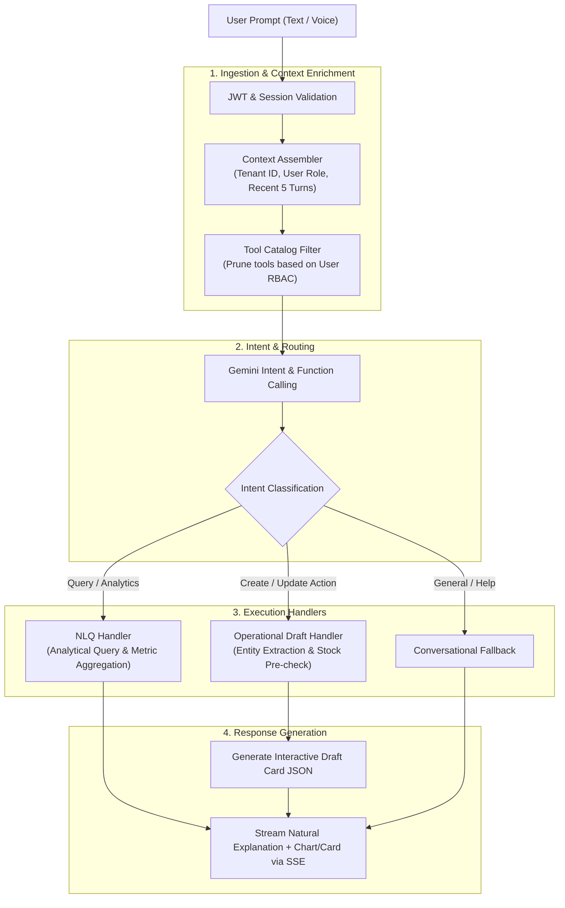
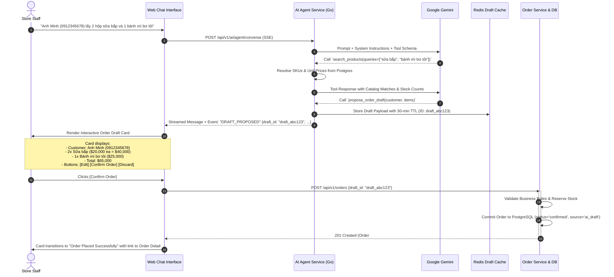

# Hexta — AI Agent Engine & Interaction Design

- **Document Version**: 1.0.0
- **Status**: Approved Baseline
- **Author**: Solution Architecture Team
- **Related Documents**: [`docs/vision.md`](file:///Users/truonghoang/Documents/dev/personal/Hexta/docs/vision.md), [`docs/architecture/system-architecture.md`](file:///Users/truonghoang/Documents/dev/personal/Hexta/docs/architecture/system-architecture.md), [`docs/architecture/multi-tenancy-and-security.md`](file:///Users/truonghoang/Documents/dev/personal/Hexta/docs/architecture/multi-tenancy-and-security.md)

---

## 1. Core Philosophy & Architectural Boundary

Hexta rejects the brittle "Agentic Autonomous Execution" paradigm where an LLM is given direct database write privileges. Instead, Hexta formalizes an **AI-Assisted Operations Framework**:

$$\textbf{User Prompt} \xrightarrow{\text{LLM}} \textbf{Structured Intent} \xrightarrow{\text{System}} \textbf{Interactive Draft} \xrightarrow{\text{Human Confirmation}} \textbf{Deterministic Execution}$$

### Core Tenets
1. **Zero Direct DB Mutations**: The AI model **never** executes SQL `INSERT`, `UPDATE`, or `DELETE`. It only queries read-only tools and constructs validated Drafts.
2. **Schema-Governed Function Calling**: Interactions with backend services strictly occur via type-safe Function Calling schemas with strict parameter validation.
3. **Human-in-the-Loop (HITL) as a First-Class Citizen**: Every transactional operation must be reviewed and approved by an authorized human operator via an interactive UI component.
4. **Active Disambiguation**: When an instruction is ambiguous (e.g., multiple customers with the same name, or vague SKU descriptions), the agent must prompt the user to clarify rather than guessing.

---

## 2. AI Engine Pipeline Architecture



---

## 3. Tool Manifest & Capability Registry

The AI Agent interacts with the core Go services through a registry of tightly typed tools exposed via JSON Schema.

### 3.1. Standard Tool Catalog

| Tool Name | Scope | Role Required | Description |
| :--- | :--- | :--- | :--- |
| `search_products` | Inventory | `inventory:read` | Search active catalog items by name, barcode, or SKU with live stock counts. |
| `check_stock_availability`| Inventory | `inventory:read` | Check available quantity for specific SKU before drafting order. |
| `lookup_customer` | CRM / OMS | `orders:read` | Search customer profile by phone number or name. |
| `propose_order_draft` | OMS | `orders:create` | Assembles a structured Order Draft payload for user confirmation. |
| `query_sales_metrics` | Analytics | `analytics:revenue`| Aggregates revenue, order volume, and top products for specified time window. |
| `list_pending_orders` | OMS | `orders:read` | Lists orders requiring processing or dispatch. |

### 3.2. Example Tool Definition: `propose_order_draft`
```json
{
  "name": "propose_order_draft",
  "description": "Generates a structured order draft for customer purchase to be confirmed by user.",
  "parameters": {
    "type": "object",
    "properties": {
      "customer_name": { "type": "string", "description": "Customer full name" },
      "customer_phone": { "type": "string", "description": "10-digit Vietnamese phone number" },
      "shipping_address": { "type": "string", "description": "Delivery address if specified" },
      "items": {
        "type": "array",
        "items": {
          "type": "object",
          "properties": {
            "product_id": { "type": "string", "description": "UUID of product" },
            "product_name": { "type": "string", "description": "Recognized product name" },
            "quantity": { "type": "integer", "minimum": 1 },
            "unit_price": { "type": "number", "minimum": 0 },
            "variant": { "type": "string", "description": "Size, color, or variant code" }
          },
          "required": ["product_name", "quantity"]
        }
      },
      "payment_method": {
        "type": "string",
        "enum": ["cod", "bank_transfer", "cash"],
        "default": "cod"
      },
      "notes": { "type": "string" }
    },
    "required": ["items"]
  }
}
```

---

## 4. The Interactive Draft Lifecycle (The "Aha Moment")

This workflow represents the flagship user experience defined in Section 12 of the Vision Document.



---

## 5. Natural Language Query (NLQ) & Visual Analytics

### 5.1. Text-to-Insight Architecture
For business owners asking questions like:
> *"Doanh thu 7 ngày qua của quán thế nào? Mặt hàng nào bán chạy nhất?"*

1. **Analytical Tool Call**: LLM triggers `query_sales_metrics(timeframe="last_7_days", group_by="product")`.
2. **Aggregated Metric Computation**: The Go backend runs an optimized aggregated query against indexed order views.
3. **Structured Response Synthesis**: The agent returns both:
   - Natural language executive summary.
   - A standardized **Chart Specification** consumed by Next.js frontend chart libraries (e.g., Recharts).

```json
{
  "type": "analytics_summary",
  "text": "Trong 7 ngày qua, tổng doanh thu đạt **14,500,000 VNĐ** trên 86 đơn hàng. Sản phẩm bán chạy nhất là **Sữa bắp đóng chai** (42 chai).",
  "widget": {
    "chart_type": "bar",
    "title": "Doanh thu 7 ngày qua",
    "x_axis": "date",
    "y_axis": "revenue",
    "data": [
      { "date": "03/10", "revenue": 1800000 },
      { "date": "04/10", "revenue": 2100000 },
      { "date": "05/10", "revenue": 2400000 }
    ]
  }
}
```

---

## 6. Disambiguation & Entity Resolution Strategy

Real-world SME input often contains ambiguous references. The Hexta agent handles this gracefully:

### 6.1. Product Ambiguity Resolution
- **Scenario**: User says: *"Lấy cho khách 2 cái áo thun"*.
- **Catalog Matches**: `Áo thun trắng cổ tròn (Size M, L, XL)`, `Áo thun đen in hình (Size M, L)`.
- **Agent Behavior**: Rather than guessing or halting, the agent returns an interactive selection card:
  > *"Em tìm thấy 2 mẫu áo thun trong kho. Bạn muốn chọn mẫu nào ạ?"*
  > - `[1] Áo thun trắng cổ tròn (Tồn: 45)`
  > - `[2] Áo thun đen in hình (Tồn: 12)`
- Clicking an option updates the conversation turn and completes the draft.

### 6.2. Stock Depletion Handling
- If stock is insufficient, the draft indicates the shortage clearly:
  > *"Sản phẩm 'Bánh mì bơ tỏi' hiện chỉ còn 1 cái trong kho (khách đặt 3). Bạn có muốn tạo đơn với số lượng 1 không?"*

---

## 7. Performance & Latency Targets

| Metric | Target | Mitigation Strategy |
| :--- | :--- | :--- |
| **First Token Latency (TTFT)** | $< 800\text{ ms}$ | Direct streaming via Server-Sent Events (SSE). |
| **Complete Draft Generation** | $< 2.5\text{ s}$ | Parallelized tool execution & caching frequently queried product catalog in Redis. |
| **Context Window Consumption**| $< 4,000\text{ tokens}$ | Sliding context window (retain only current turn + last 3 turns); summarize older turns. |
| **Draft Expiration** | 30 minutes | Redis TTL prevents stale stock reservations and orphaned drafts. |
