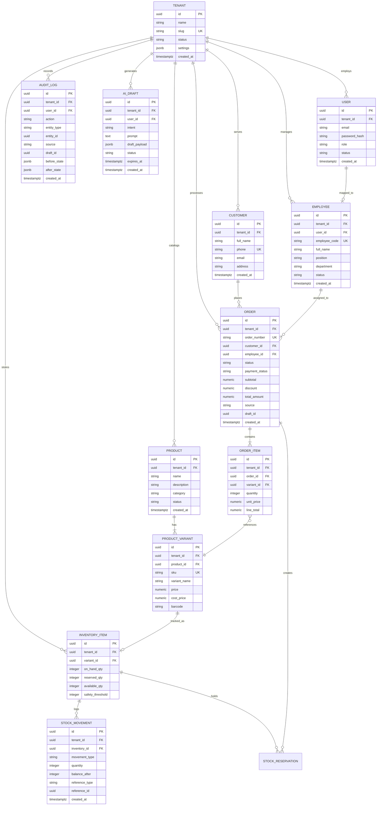
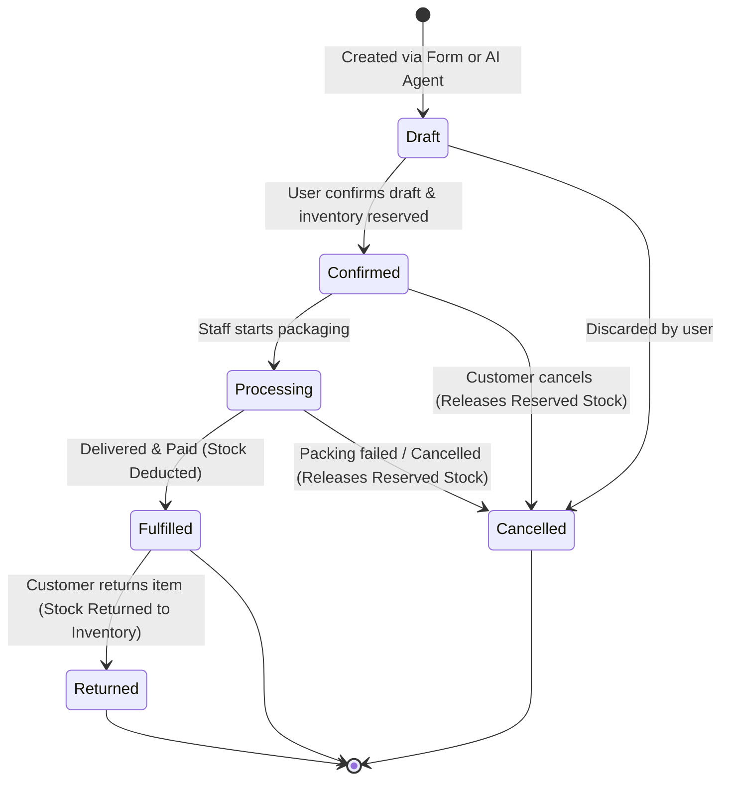
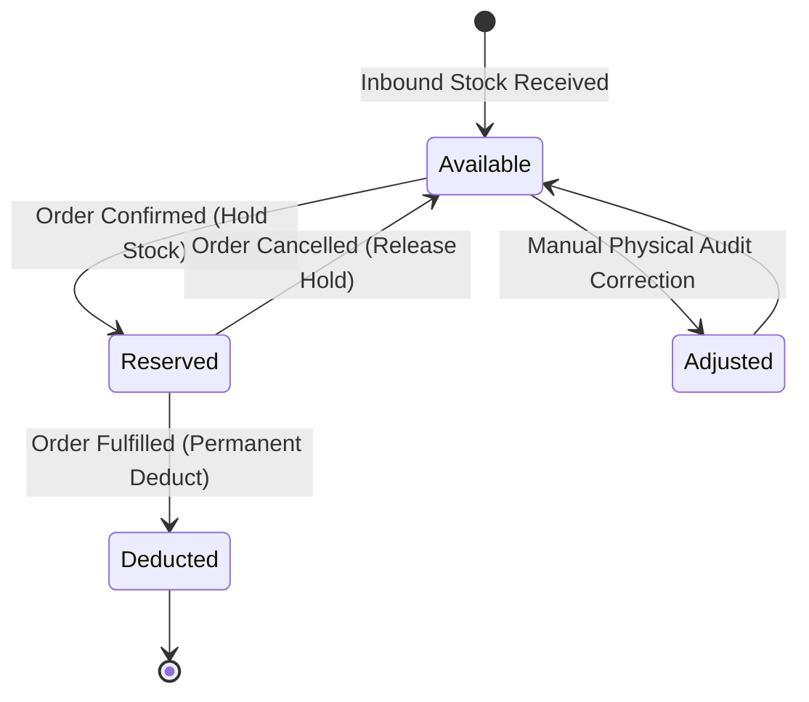

# Hexta — Data Models & State Machines Architecture

- **Document Version**: 1.0.0
- **Status**: Approved Baseline
- **Author**: Solution Architecture Team
- **Related Documents**: [`docs/vision.md`](file:///Users/truonghoang/Documents/dev/personal/Hexta/docs/vision.md), [`docs/architecture/system-architecture.md`](file:///Users/truonghoang/Documents/dev/personal/Hexta/docs/architecture/system-architecture.md), [`docs/architecture/multi-tenancy-and-security.md`](file:///Users/truonghoang/Documents/dev/personal/Hexta/docs/architecture/multi-tenancy-and-security.md)

---

## 1. Domain Entity Relationship Diagram (ERD)

The relational schema in PostgreSQL 17 is organized around tenant-scoped bounded contexts: Identity & Tenant, Product & Catalog, Inventory, Order Management, Customer, HR, and Audit/AI.



---

## 2. Relational Schema Specifications (PostgreSQL / GORM)

### 2.1. Product & Catalog Models
```go
type Product struct {
    BaseTenantModel
    Name        string           `gorm:"type:varchar(255);not null;index"`
    Description string           `gorm:"type:text"`
    Category    string           `gorm:"type:varchar(100);index"`
    Status      string           `gorm:"type:varchar(32);default:'active';index"` // active, archived
    Variants    []ProductVariant `gorm:"foreignKey:ProductID"`
}

type ProductVariant struct {
    BaseTenantModel
    ProductID   uuid.UUID       `gorm:"type:uuid;not null;index"`
    SKU         string          `gorm:"type:varchar(64);not null;index"`
    VariantName string          `gorm:"type:varchar(128);not null"` // e.g. "Size L / White"
    Price       decimal.Decimal `gorm:"type:numeric(15,2);not null"`
    CostPrice   decimal.Decimal `gorm:"type:numeric(15,2);default:0"`
    Barcode     string          `gorm:"type:varchar(64);index"`
}
```

### 2.2. Inventory Models
```go
type InventoryItem struct {
    BaseTenantModel
    VariantID       uuid.UUID `gorm:"type:uuid;not null;uniqueIndex:idx_tenant_variant"`
    OnHandQty       int       `gorm:"not null;default:0"` // Physical quantity in warehouse
    ReservedQty     int       `gorm:"not null;default:0"` // Quantity held for pending orders
    AvailableQty    int       `gorm:"not null;default:0"` // OnHandQty - ReservedQty
    SafetyThreshold int       `gorm:"not null;default:5"` // Threshold for low-stock alert
}

type StockMovement struct {
    BaseTenantModel
    InventoryID   uuid.UUID `gorm:"type:uuid;not null;index"`
    MovementType  string    `gorm:"type:varchar(32);not null"` // 'INBOUND', 'OUTBOUND', 'ADJUSTMENT'
    Quantity      int       `gorm:"not null"`
    BalanceAfter  int       `gorm:"not null"`
    ReferenceType string    `gorm:"type:varchar(64)"`          // 'ORDER', 'INVENTORY_AUDIT'
    ReferenceID   uuid.UUID `gorm:"type:uuid;index"`
    Notes         string    `gorm:"type:text"`
}
```

### 2.3. Order Models
```go
type Order struct {
    BaseTenantModel
    OrderNumber   string          `gorm:"type:varchar(64);not null;uniqueIndex:idx_tenant_order_num"`
    CustomerID    *uuid.UUID      `gorm:"type:uuid;index"`
    EmployeeID    *uuid.UUID      `gorm:"type:uuid;index"`
    Status        string          `gorm:"type:varchar(32);not null;default:'draft';index"`
    PaymentStatus string          `gorm:"type:varchar(32);not null;default:'unpaid';index"`
    Subtotal      decimal.Decimal `gorm:"type:numeric(15,2);not null;default:0"`
    Discount      decimal.Decimal `gorm:"type:numeric(15,2);not null;default:0"`
    TotalAmount   decimal.Decimal `gorm:"type:numeric(15,2);not null;default:0"`
    Source        string          `gorm:"type:varchar(32);not null;default:'web_form'"` // 'web_form', 'ai_draft'
    DraftID       *uuid.UUID      `gorm:"type:uuid;index"`
    Items         []OrderItem     `gorm:"foreignKey:OrderID"`
}

type OrderItem struct {
    BaseTenantModel
    OrderID   uuid.UUID       `gorm:"type:uuid;not null;index"`
    VariantID uuid.UUID       `gorm:"type:uuid;not null;index"`
    Quantity  int             `gorm:"not null"`
    UnitPrice decimal.Decimal `gorm:"type:numeric(15,2);not null"`
    LineTotal decimal.Decimal `gorm:"type:numeric(15,2);not null"`
}
```

---

## 3. Order Lifecycle State Machine

Orders progress through a strict finite state machine (FSM) ensuring consistent business rules:



### Transition Guard Rules
1. **`Draft -> Confirmed`**:
   - Verification: Every item in the order must have `AvailableQty >= Item.Quantity`.
   - Action: Atomically increment `ReservedQty` by item quantity in a single DB transaction.
2. **`Confirmed -> Cancelled`**:
   - Action: Decrement `ReservedQty` by item quantity.
3. **`Processing -> Fulfilled`**:
   - Action: Atomically decrement `OnHandQty` and decrement `ReservedQty`. Record `StockMovement` (OUTBOUND).
4. **`Fulfilled -> Returned`**:
   - Action: Increment `OnHandQty`. Record `StockMovement` (INBOUND - Return).

---

## 4. Inventory Reservation & Stock Mutation Lifecycle

To prevent overselling under concurrent requests, stock is managed through a **two-phase allocation model**:



### Concurrency Control Pattern (Optimistic vs. Row Lock)
When reserving stock, the repository performs atomic conditional updates:

```sql
UPDATE inventory_items
SET 
    reserved_qty = reserved_qty + :quantity,
    available_qty = available_qty - :quantity,
    updated_at = NOW()
WHERE 
    tenant_id = :tenant_id 
    AND variant_id = :variant_id
    AND available_qty >= :quantity;
```
If rows affected is `0`, the system aborts the transaction with `ErrInsufficientStock`, preventing race conditions without heavy table locking.
