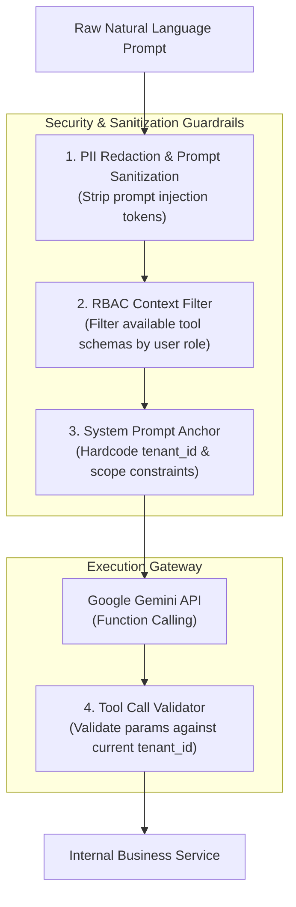

# Hexta — Multi-Tenancy & Security Architecture

- **Document Version**: 1.0.0
- **Status**: Approved Baseline
- **Author**: Solution Architecture Team
- **Related Documents**: [`docs/vision.md`](file:///Users/truonghoang/Documents/dev/personal/Hexta/docs/vision.md), [`docs/architecture/system-architecture.md`](file:///Users/truonghoang/Documents/dev/personal/Hexta/docs/architecture/system-architecture.md)

---

## 1. Multi-Tenancy Strategy

### 1.1. Tenancy Model Evaluation
When designing SaaS platforms for SMEs, three primary tenancy models exist:

| Model | Architecture | Pros | Cons | Hexta Decision |
| :--- | :--- | :--- | :--- | :--- |
| **Silo (Database-per-tenant)** | Separate DB instance per customer | Maximum physical isolation, custom backup schedules | Expensive infrastructure footprint, complex migration orchestration across hundreds of databases | *Rejected for MVP* (Overkill for SMEs) |
| **Bridge (Schema-per-tenant)** | Single DB instance, isolated PostgreSQL schema per tenant | Good logical isolation, simplified per-tenant backup | Connection pool explosion, migration latency scales linearly with tenant count | *Rejected for MVP* |
| **Pool (Shared DB, Shared Schema)** | Shared DB and tables with `tenant_id` discriminator column | Cost-effective, high tenant density, instant migrations via Atlas, simple connection pooling | Requires strict application-level and DB-level enforcement to avoid cross-tenant data leaks | **Selected Baseline** |

### 1.2. The Pooled Isolation Approach in Hexta
Hexta adopts a **Pooled Multi-Tenancy model with Defense-in-Depth isolation**:
1. **Application Layer (Context Propagation)**: Middleware parses and validates tenant context on every request and injects it into Go's `context.Context`.
2. **Repository Layer (GORM Auto-Scopes)**: Repositories enforce `tenant_id` predicates across all CRUD operations.
3. **Database Layer (PostgreSQL Row-Level Security - RLS)**: Native PostgreSQL policies prevent cross-tenant queries even in the event of an application-layer bug.
4. **Cache & Vector Layer (Key Namespacing & Tenant Metadata)**: Redis keys and Qdrant payloads are strictly namespaced by `tenant_id`.

---

## 2. Tenant Context Lifecycle & Propagation

```mermaid
sequenceDiagram
    autonumber
    actor Client as Web Client
    participant MidAuth as Auth & JWT Middleware
    participant MidTenant as TenantContext Middleware
    participant Controller as HTTP Controller
    participant Service as Domain Service
    participant Repo as GORM Repository
    participant DB as PostgreSQL 17 (RLS Enabled)

    Client->>MidAuth: Request with Bearer JWT
    activate MidAuth
    MidAuth->>MidAuth: Verify Signature & Expiry
    MidAuth->>MidTenant: Forward with User Claims
    deactivate MidAuth
    
    activate MidTenant
    MidTenant->>MidTenant: Validate tenant_id exists & Tenant status is 'active'
    MidTenant->>MidTenant: ctx = context.WithValue(ctx, TenantIDKey, tenantID)
    MidTenant->>Controller: Invoke Handler with Enriched Context
    deactivate MidTenant
    
    activate Controller
    Controller->>Service: Call Service Method (ctx, dto)
    deactivate Controller
    
    activate Service
    Service->>Repo: Call Repository Method (ctx, filter)
    deactivate Service
    
    activate Repo
    Repo->>Repo: Extract tenantID = ctx.Value(TenantIDKey)
    Repo->>DB: SET LOCAL app.current_tenant_id = 'tenantID';<br/>SELECT * FROM orders WHERE tenant_id = 'tenantID' AND id = '...';
    activate DB
    DB->>DB: RLS Policy Validates: tenant_id == current_setting('app.current_tenant_id')
    DB-->>Repo: Return Tenant-Isolated Records
    deactivate DB
    Repo-->>Service: Return Entities
    deactivate Repo
```

### 2.1. Go Context Propagation Pattern
```go
package contextutil

import (
	"context"
	"github.com/google/uuid"
	"github.com/TruongHoang2004/Hexta/packages/shared/pkg/errors"
)

type contextKey string

const (
	TenantIDKey contextKey = "tenant_id"
	UserIDKey   contextKey = "user_id"
	UserRoleKey contextKey = "user_role"
)

func WithTenantID(ctx context.Context, tenantID uuid.UUID) context.Context {
	return context.WithValue(ctx, TenantIDKey, tenantID)
}

func GetTenantID(ctx context.Context) (uuid.UUID, error) {
	val := ctx.Value(TenantIDKey)
	if val == nil {
		return uuid.Nil, errors.NewUnauthorizedError("tenant context missing")
	}
	tenantID, ok := val.(uuid.UUID)
	if !ok || tenantID == uuid.Nil {
		return uuid.Nil, errors.NewUnauthorizedError("invalid tenant context")
	}
	return tenantID, nil
}
```

---

## 3. Database Security & PostgreSQL Row-Level Security (RLS)

To achieve enterprise-grade data isolation, all tenant-scoped tables implement PostgreSQL Row-Level Security:

### 3.1. Atlas / SQL RLS Migration Template
```sql
-- 1. Create helper function to read session tenant
CREATE OR REPLACE FUNCTION current_tenant_id() RETURNS uuid AS $$
    SELECT NULLIF(current_setting('app.current_tenant_id', true), '')::uuid;
$$ LANGUAGE sql STABLE;

-- 2. Enable RLS on business tables
ALTER TABLE orders ENABLE ROW LEVEL SECURITY;
ALTER TABLE order_items ENABLE ROW LEVEL SECURITY;
ALTER TABLE inventory_items ENABLE ROW LEVEL SECURITY;
ALTER TABLE employees ENABLE ROW LEVEL SECURITY;
ALTER TABLE audit_logs ENABLE ROW LEVEL SECURITY;

-- 3. Define mandatory RLS Policy for orders
CREATE POLICY tenant_isolation_orders ON orders
    FOR ALL
    USING (tenant_id = current_tenant_id())
    WITH CHECK (tenant_id = current_tenant_id());
```

---

## 4. Role-Based Access Control (RBAC) Matrix

Hexta utilizes a standardized hierarchical RBAC model designed for SMEs.

### 4.1. Standard System Roles
1. **`TenantOwner`**: Full ownership of the tenant account, billing, organization settings, and staff provisioning.
2. **`TenantManager`**: Operational supervisor. Can view all operational metrics, manage inventory, confirm orders, and query business intelligence.
3. **`OperationsStaff`**: Frontline worker. Can create order drafts, process shipments, view stock availability, and use AI draft assistance. Cannot view global revenue reports or employee salaries.
4. **`Auditor / Accountant`**: Read-only access to historical orders, invoices, and audit logs.

### 4.2. Granular Permissions Matrix

| Permission Key | Description | TenantOwner | TenantManager | OperationsStaff | Auditor |
| :--- | :--- | :---: | :---: | :---: | :---: |
| `tenant:manage` | Manage business profile & billing | ✅ | ❌ | ❌ | ❌ |
| `users:manage` | Invite, edit, remove staff accounts | ✅ | ❌ | ❌ | ❌ |
| `orders:create` | Create and confirm new orders | ✅ | ✅ | ✅ | ❌ |
| `orders:read` | View orders and customer details | ✅ | ✅ | ✅ | ✅ |
| `orders:update` | Modify existing order statuses | ✅ | ✅ | ✅ | ❌ |
| `orders:cancel` | Cancel orders and trigger refunds | ✅ | ✅ | ❌ | ❌ |
| `inventory:read`| Check stock levels & locations | ✅ | ✅ | ✅ | ✅ |
| `inventory:adjust`| Adjust stock quantities / inbound | ✅ | ✅ | ❌ | ❌ |
| `hr:read` | View employee directory | ✅ | ✅ | ✅ | ❌ |
| `hr:manage` | Manage payroll, roles, shifts | ✅ | ❌ | ❌ | ❌ |
| `analytics:revenue` | View revenue, profit, cash flow | ✅ | ✅ | ❌ | ✅ |
| `ai:query` | Natural language queries (NLQ) | ✅ | ✅ | ✅ (Scoped) | ✅ |
| `ai:operate` | Conversational order drafting | ✅ | ✅ | ✅ | ❌ |

---

## 5. AI Agent Security & Prompt Sandboxing

One of the most critical aspects of Hexta is preventing **cross-tenant data leakage via LLM prompts** and **prompt injection attacks**.



### 5.1. Prompt Injection Defenses
1. **Structural Separation**: System instructions, schema definitions, and user inputs are strictly passed via dedicated fields in the SDK (`SystemInstruction`, `Contents`), rather than string concatenation.
2. **Role-Enforced Tool Manifests**: If an `OperationsStaff` user triggers the AI agent, the `analytics:revenue` tools are **completely omitted** from the tool schema list sent to the LLM. The model has zero knowledge that revenue tools exist.
3. **Double Tenant Verification**: When the LLM outputs a tool call (e.g., `query_orders(customer_name="John")`), the server overrides or verifies the `tenant_id` from the authenticated session context. The LLM can **never** specify or override the target `tenant_id`.

---

## 6. Audit Trail & Data Lineage Engine

To fulfill the "Auditability" and "Data Lineage" requirements of the Data Platform, every state change records an immutable audit record.

### 6.1. Audit Log Schema
```sql
CREATE TABLE audit_logs (
    id UUID PRIMARY KEY DEFAULT gen_random_uuid(),
    tenant_id UUID NOT NULL REFERENCES tenants(id),
    user_id UUID NOT NULL REFERENCES users(id),
    action VARCHAR(64) NOT NULL,              -- e.g., 'ORDER_CREATED', 'STOCK_ADJUSTED'
    entity_type VARCHAR(64) NOT NULL,         -- e.g., 'Order', 'InventoryItem'
    entity_id UUID NOT NULL,
    source VARCHAR(32) NOT NULL,              -- 'web_form', 'ai_agent_draft', 'system_event', 'api'
    draft_id UUID NULL,                       -- Correlates back to the AI draft if created via agent
    before_state JSONB NULL,                  -- State snapshot prior to mutation
    after_state JSONB NOT NULL,               -- State snapshot after mutation
    ip_address VARCHAR(45) NULL,
    user_agent TEXT NULL,
    created_at TIMESTAMPTZ NOT NULL DEFAULT NOW()
);

CREATE INDEX idx_audit_logs_tenant_entity ON audit_logs(tenant_id, entity_type, entity_id);
CREATE INDEX idx_audit_logs_tenant_created ON audit_logs(tenant_id, created_at DESC);
```

### 6.2. Lineage Chain for AI-Assisted Operations
When an order is created through an AI conversation:
1. `ai_drafts` records the initial conversation prompt, extracted entities, and draft JSON.
2. When the user confirms the draft, the order is created with `source = 'ai_agent_draft'` and `draft_id = <draft_uuid>`.
3. The `audit_logs` entry links `draft_id`, enabling full retrospective traceability:
   $$\text{User Prompt} \longrightarrow \text{AI Draft} \longrightarrow \text{User Confirmation} \longrightarrow \text{Order Placed} \longrightarrow \text{Inventory Deducted}$$
This allows auditors to verify exactly how an AI prompt translated into a real financial transaction.
