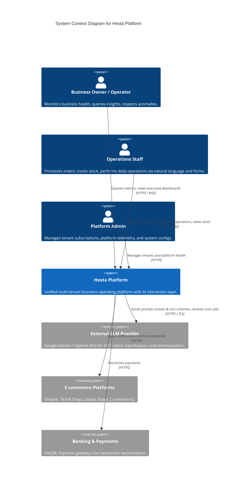
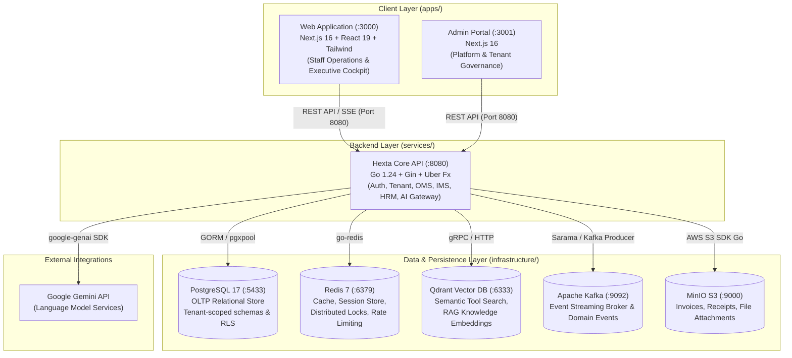
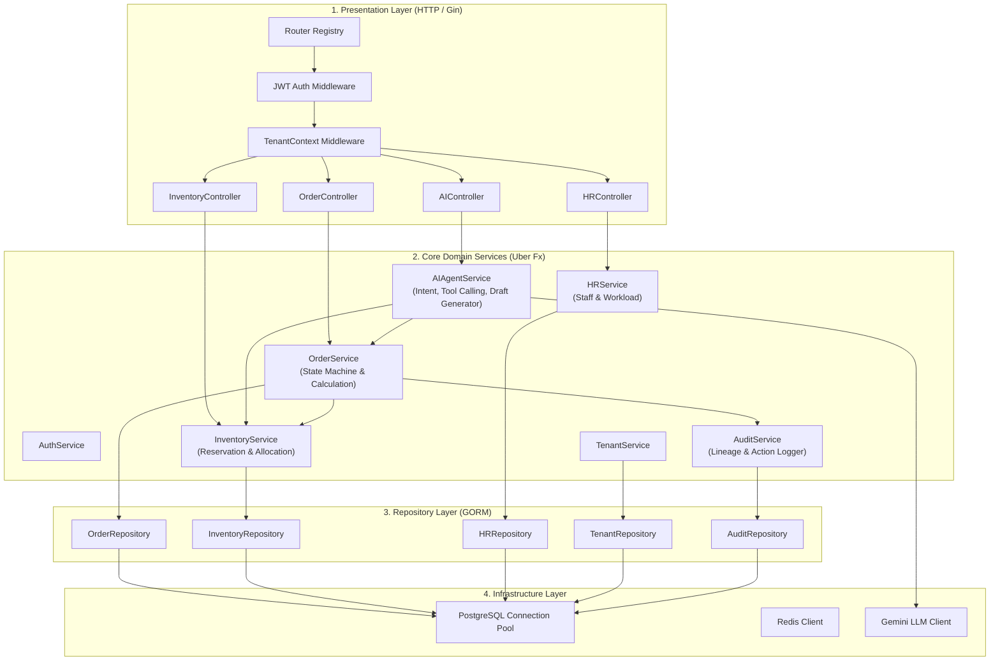
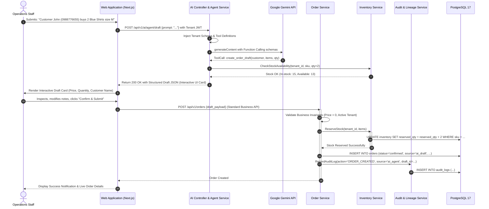
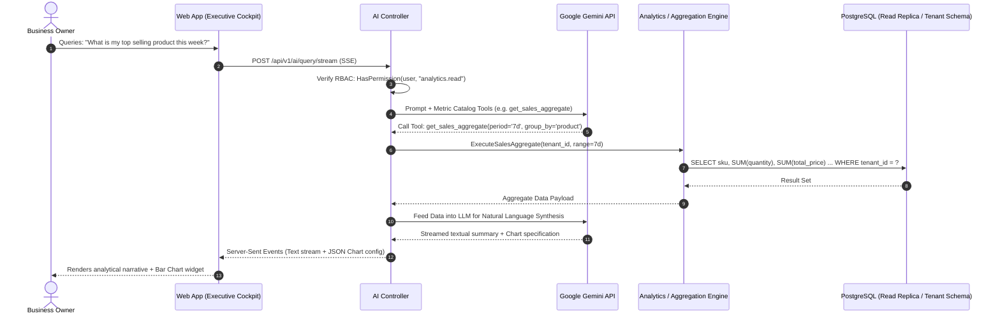

# Hexta — System Architecture Document (SAD)

- **Document Version**: 1.0.0
- **Status**: Approved Baseline
- **Author**: Solution Architecture Team
- **Target Audience**: Engineering Leads, Backend/Frontend Developers, Thesis Review Committee
- **Related Vision Document**: [`docs/vision.md`](file:///Users/truonghoang/Documents/dev/personal/Hexta/docs/vision.md)

---

## 1. Executive Summary & Architectural Drivers

### 1.1. Context & Business Vision
Hexta is an AI-native, unified business operating platform tailored for Small and Medium Enterprises (SMEs). Traditional enterprise resource planning (ERP) platforms suffer from fragmented modules, steep learning curves, and manual form-heavy operations. Conversely, naive generative AI wrappers pose hallucinations and data integrity hazards.

Hexta bridges this dichotomy through a core architectural tenet:
> **AI acts as the natural intent and interaction layer; the Business Workflow Engine remains the deterministic, immutable source of truth.**

```
┌────────────────────────────────────────────────────────┐
│                   Natural Language UI                  │
└───────────────────────────┬────────────────────────────┘
                            │ Conversational Intent
                            ▼
┌────────────────────────────────────────────────────────┐
│             AI Agent Orchestrator (LLM)                │
│    - Intent Extraction      - Slot Filling             │
│    - Tool Calling           - Draft Proposal           │
└───────────────────────────┬────────────────────────────┘
                            │ Interactive Draft Card
                            ▼
┌────────────────────────────────────────────────────────┐
│         Human-in-the-Loop Confirmation Gate            │
└───────────────────────────┬────────────────────────────┘
                            │ Approved Command
                            ▼
┌────────────────────────────────────────────────────────┐
│          Deterministic Business Workflow               │
│    - Domain State Machine   - Validation Rules         │
│    - Inventory Reservation  - Multi-tenant Isolation   │
│    - Outbox Event Bus       - Audit & Lineage Log      │
└────────────────────────────────────────────────────────┘
```

### 1.2. Primary Architectural Drivers
1. **Multi-Tenancy**: Logical isolation of customer data with zero cross-tenant data leaks.
2. **Determinism & Auditability**: Every state modification must be traceable (who, when, what, via web form or AI draft).
3. **Low-Latency AI Interactions**: Streaming responses (Server-Sent Events) and sub-3-second end-to-end response times for natural language queries.
4. **Modularity & Monorepo Governance**: Decoupled service domains following Clean Architecture and Uber Fx dependency injection.

---

## 2. C4 Model — System Architecture

### 2.1. Level 1: System Context Diagram



---

### 2.2. Level 2: Container Diagram



---

### 2.3. Level 3: Component Diagram (`services/api`)

The Go backend adheres strictly to the 5-layer Clean Architecture outlined in [`GEMINI.md`](file:///Users/truonghoang/Documents/dev/personal/Hexta/GEMINI.md):

```
services/api/
├── cmd/
│   └── main.go                         # Uber Fx runtime assembler & lifecycle hooks
├── config/                             # Viper / Env config loader
└── internal/
    ├── present/http/
    │   ├── controller/                 # HTTP controllers (Gin handlers, validation)
    │   ├── dto/                        # Request / Response DTOs
    │   ├── middleware/                 # AuthN, TenantContext, RateLimit, Telemetry
    │   └── router/                     # Public & Private router registration
    ├── core/
    │   ├── domain/                     # Pure domain entities, values, state machines
    │   ├── service/                    # Business orchestration services
    │   └── port/                       # Inbound & Outbound interfaces
    ├── repository/                     # Database access (GORM, Redis wrappers)
    ├── infrastructure/                 # External clients (DB, Redis, Gemini, Kafka)
    └── bootstrap/                      # Uber Fx module builders (BuildDatabase, BuildService, etc.)
```



---

## 3. Dynamic Runtime Workflows

### 3.1. Workflow 1: AI-Assisted Operation (Conversational Order Creation)
Demonstrates the safe separation between AI intent translation and deterministic execution.



---

### 3.2. Workflow 2: Natural Language Query (Executive NLQ)
Demonstrates secure, read-only analytics execution respecting Tenant RBAC.



---

## 4. Multi-Tenancy & Data Isolation Model

Hexta implements **Pooled Multi-Tenancy with Row-Level Discrimination and Context Propagation**:

1. **Tenant Identification**: Every authenticated request passes through `middleware.TenantContext()` which extracts the `tenant_id` from the verified JWT claims and sets it into the standard Go `context.Context`.
2. **Repository Boundary**:
   - Every GORM database model embeds a `TenantID uuid.UUID` field with indexing:
     ```go
     type BaseTenantModel struct {
         ID        uuid.UUID      `gorm:"type:uuid;primaryKey;default:gen_random_uuid()"`
         TenantID  uuid.UUID      `gorm:"type:uuid;not null;index"`
         CreatedAt time.Time      `gorm:"not null"`
         UpdatedAt time.Time      `gorm:"not null"`
         DeletedAt gorm.DeletedAt `gorm:"index"`
     }
     ```
   - Repository base wrappers inject `WHERE tenant_id = ?` into all `SELECT`, `UPDATE`, and `DELETE` queries.
3. **Database-Level Protection (PostgreSQL RLS)**:
   - For defense-in-depth, PostgreSQL Row-Level Security (RLS) policies are active:
     ```sql
     ALTER TABLE orders ENABLE ROW LEVEL SECURITY;
     CREATE POLICY tenant_isolation_policy ON orders
         FOR ALL
         USING (tenant_id = current_setting('app.current_tenant_id')::uuid);
     ```

---

## 5. Technology Stack Rationale Matrix

| Technology | Layer | Choice Rationale |
| :--- | :--- | :--- |
| **Go 1.24+** | Backend Services | Native concurrency (goroutines), minimal memory footprint, rapid cold-start times, compiled type safety. |
| **Gin Framework** | HTTP Routing | Mature, battle-tested HTTP router with high throughput and low allocs. |
| **Uber Fx** | Dependency Injection | Modular dependency graph resolution; explicit lifecycle management (`OnStart`, `OnStop`) avoiding global state. |
| **Next.js 16 (App Router)** | Client Applications | Server Components for instant data loading, Client Components for dynamic chat interaction, unified TypeScript SDK. |
| **PostgreSQL 17** | Relational Persistence | Robust transactional guarantees (ACID), native JSONB support, Row-Level Security (RLS), performant indexing. |
| **Atlas CLI** | Migration Engine | Declarative schema management; eliminates manual migration drift across development and CI/CD pipelines. |
| **Google Gemini API** | AI / LLM Engine | Native Function Calling support, low latency, Vietnamese comprehension, large token context window. |
| **Qdrant Vector DB** | Semantic Search | Rust-based high-performance vector search engine for RAG knowledge bases and tool indexing. |
| **Apache Kafka** | Event Streaming | Partitioned event broker ensuring reliable decoupling and event replayability across modules. |

---

## 6. Observability, Security & Non-Functional Architecture

### 6.1. Telemetry & Observability
- **Distributed Tracing**: OpenTelemetry instrumentation integrated into Gin HTTP middleware (`otelgin`) and outbound HTTP/DB clients.
- **Metrics**: Prometheus collector exposed at `/metrics` collecting request counts, latencies (p50, p95, p99), DB connection pool stats, and LLM call latencies.
- **Structured Logging**: Uber Zap logger outputting structured JSON logs with correlation IDs (`trace_id`, `tenant_id`, `user_id`).

### 6.2. Security Architecture
- **Stateless Authentication**: Short-lived Access Tokens (15 min) + Refresh Tokens stored in Redis with automatic rotation.
- **Input Sanitization**: Strict DTO validation using Go `validator/v10` prior to passing parameters to business logic.
- **LLM Prompt Injection Defense**: System prompts enforce rigid schema boundaries. User input is treated strictly as conversational data, never as executable instructions.
- **Prompt PII Protection**: Masking of customer PII (e.g. phone numbers, national IDs) prior to transmission to external LLMs where feasible.

---

## 7. Architectural Roadmap & Alignment

```
Current Status:
[x] Auth & Session Infrastructure
[x] Tenant Core Service & Repository
[x] Atlas Migration Foundation

MVP Target (Thesis Delivery):
[ ] Order Domain (Catalog, Pricing, OMS State Machine)
[ ] Inventory Domain (Stock Levels, Stock Reservations)
[ ] Basic HR Domain (Staff Profiles, Workload Mapping)
[ ] AI Agent Engine (Intent Classifier, Tool Registry, Draft Card Generator)
[ ] Executive Dashboard & Chat UI (Next.js apps/web)
[ ] Audit Trail & Data Lineage Engine

Phase 2 (Post-Thesis Commercialization):
[ ] E-commerce Connectors (Shopee, TikTok Shop)
[ ] Payment Webhooks & Auto-Reconciliation
[ ] Multi-warehouse Inventory Routing

Phase 3 (Enterprise Intelligence):
[ ] Proactive Anomaly Detection
[ ] Automated Replenishment Triggers
[ ] Predictive Sales & Cashflow Modeling
```
